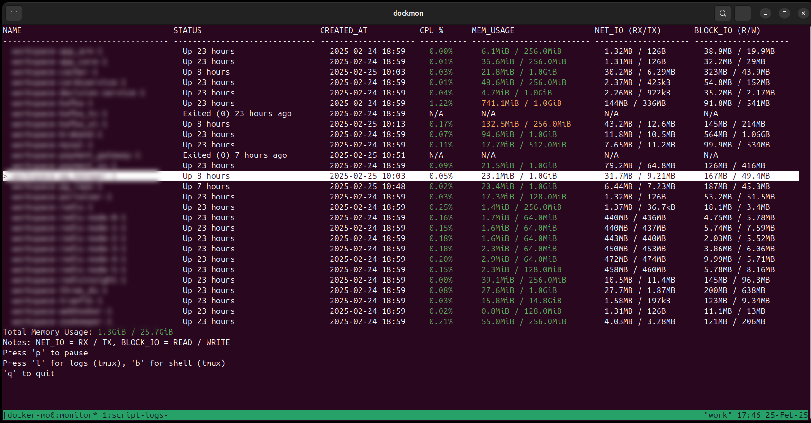

# DockMon

DockMon is a lightweight, terminal-based Docker container monitor that provides real-time insights into container metrics and logs—an alternative to Docker Desktop's graphical interface.



---

## 📦 Dependencies
- **tmux**
- **Python 3.x**
- **pipx** (optional, if installation via pipx)
- **Docker** (must be installed and running)

---

## 🚀 Installation

### Method 1: Local Clone + Make
1. **Clone the repository:**
```sh
git clone https://github.com/slava-nikulin/dockmon.git
cd dockmon
```

2. **Install locally with make:**
```sh
make install
```

### Method 2: Install directly via pipx
```sh
pipx install git+https://github.com/slava-nikulin/dockmon.git
```

---

## 🧠 Usage

### Basic usage
```sh
dockmon [--verbose]
```
- `--verbose` flag enables detailed logging to `/tmp/docker_monitor.log`.

### How DockMon works with tmux
When not in a tmux session, DockMon will automatically create a new tmux session named **docker-monitor** with two windows:

1. **monitor**: Displays the real-time table of Docker containers.
2. **script-logs**: Tails the log file `/tmp/docker_monitor.log`.

---

## 🎮 Key Bindings
- **p**: Pause/resume table updates.
- **l**: Open logs for the selected container (in a new tmux window).
- **b**: Open a shell in the selected container (in a new tmux window).
- **up/down**: Navigate through containers.
- **q**: Quit the monitor.

---

## 👥 Contributing
Pull requests and issues are welcome! If you want to contribute, please fork the repository and create a pull request with your improvements.

---

## 📜 License
This project is licensed under the **MIT License**.

